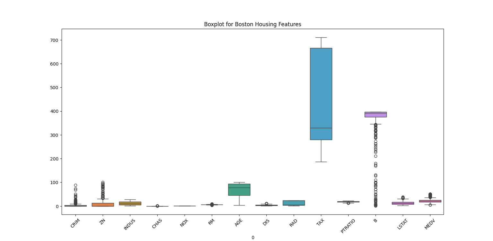
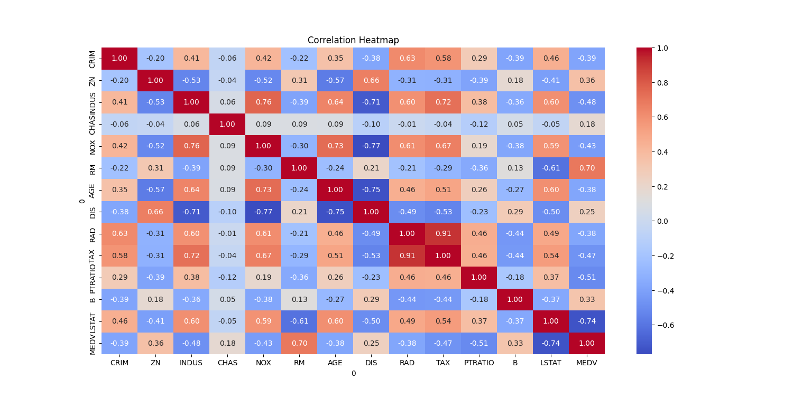
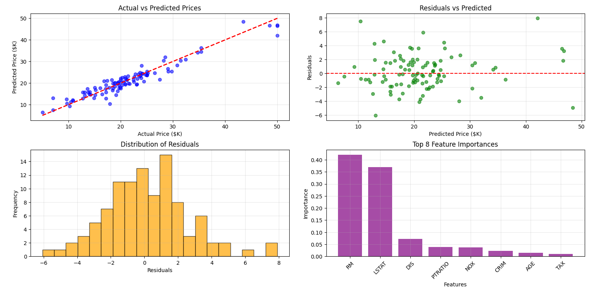

# 🏡 AI Boston House Price Prediction System  
[](https://www.python.org/)  
A full-stack machine learning web application for predicting Boston house prices using a trained Gradient Boosting Regressor model. The project includes a Flask backend API and a React frontend.

## Features
- Predict house prices based on user input features
- Batch prediction support
- Model accuracy: 91.79%
- REST API endpoints for integration
- Frontend with interactive forms and result display

## Project Structure
```
BostonHousePricePrediction/
├── app.py                      # Flask backend API
├── requirements.txt            # Python dependencies
├── *.pkl, *.csv                # Model/data files (ignored by git)
├── images/                     # Project images/figures
├── frontend/                   # React frontend app
│   ├── src/                    # React source code
│   ├── public/                 # Static assets
│   └── ...
└── ...
```

## Backend (Flask API)
[](https://flask.palletsprojects.com/)
- `app.py`: Main API with endpoints:
  - `GET /api/health` — Health check
  - `GET /api/features` — Feature info
  - `POST /api/predict` — Predict price
  - `POST /api/batch-predict` — Batch predictions
- Model and scaler loaded from `.pkl` files
- CORS enabled for frontend integration

### Running the Backend
```bash
pip install -r requirements.txt
python app.py
```

## Frontend (React)
[](https://react.dev/)
- Located in `frontend/`
- User-friendly forms for input
- Displays predictions and confidence

### Running the Frontend
```bash
cd frontend
npm install
npm start
```

## Model & Data
- Trained on the Boston Housing dataset
- Model: Gradient Boosting Regressor
- Accuracy: 91.79%
- Model/data files are ignored by git for size

## Visualizations

### Boxplot for Boston Housing Features


### Correlation Heatmap


### Model Evaluation Results

---
[](LICENSE)

[](https://github.com/Likith-java)

> Built for educational and demonstration purposes. Contributions welcome!
