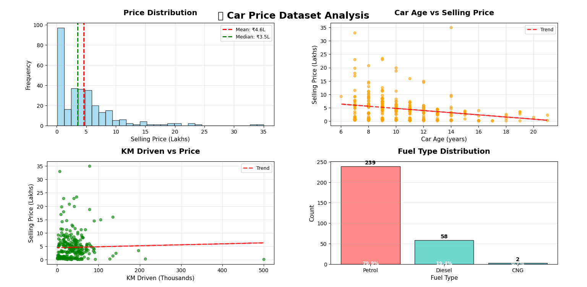
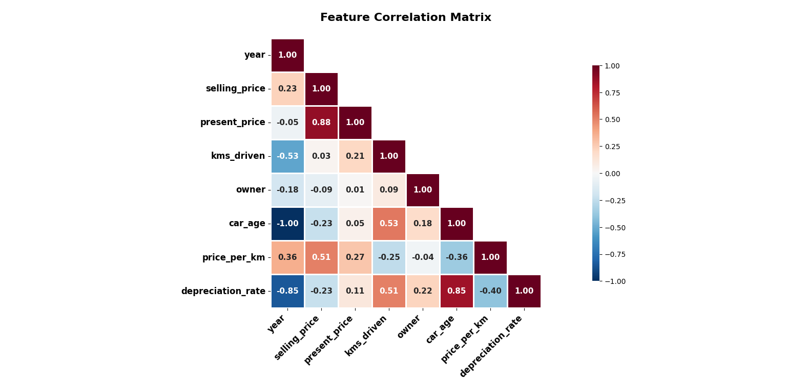
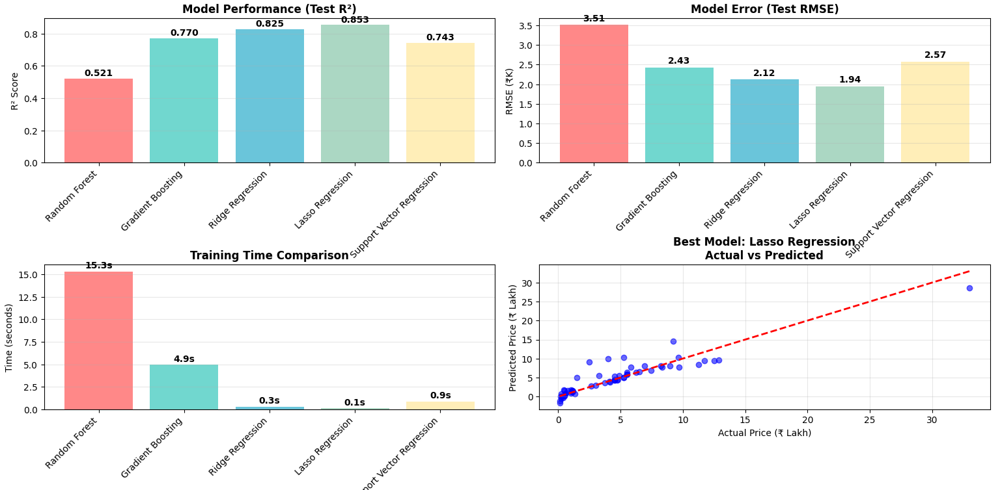
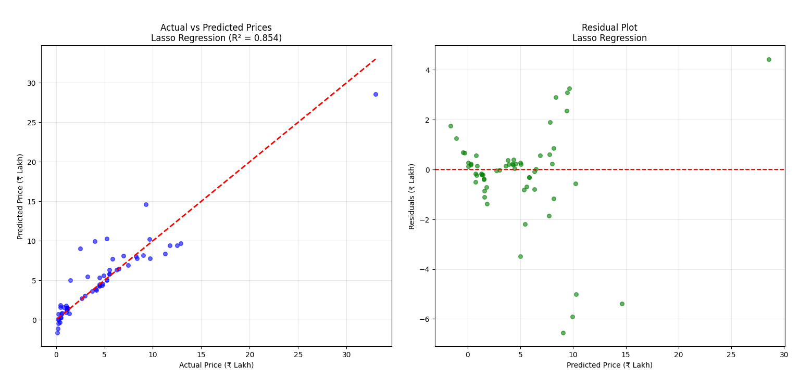
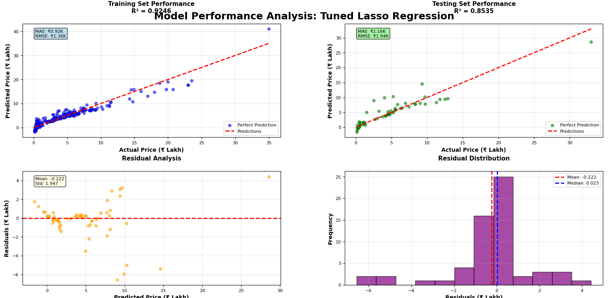
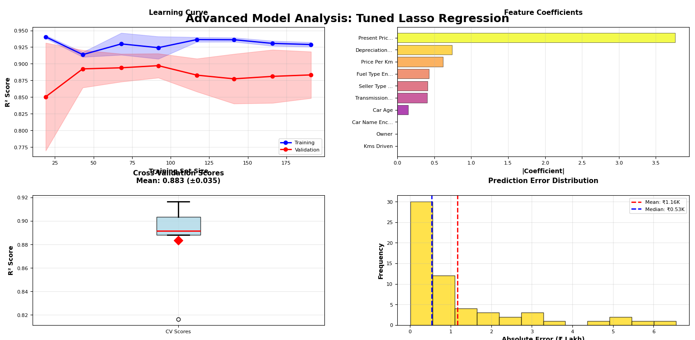

# 🚗 Car Price Prediction Project
[](https://www.python.org/)  
This project predicts used car prices using machine learning (Python backend) and provides a modern React frontend for user interaction and analytics.

## Features

- End-to-end car price prediction using machine learning
- Data cleaning, preprocessing, and feature engineering scripts
- Multiple regression models (Random Forest, Ridge, Lasso, SVR, etc.)
- Hyperparameter tuning and model evaluation
- Interactive Flask REST API for predictions
- Modern React frontend with:
	- Prediction form and results
	- Analytics dashboard with charts (Recharts, Chart.js)
	- Model performance and feature importance visualizations
- Visualization of data distributions, correlations, and model results
- .gitignore for both backend and frontend
- MIT License for open source use

## Project Structure

```
CarPricePrediction/
├── data/                  # Raw data files (e.g., car_data.csv)
├── data_preprocessing.py  # Data cleaning and preprocessing
├── feature_engineering.py # Feature engineering and EDA
├── model_training.py      # Model training and selection
├── hyperparameter_tuning.py # Hyperparameter tuning
├── model_evaluation.py    # Model evaluation and metrics
├── app.py                 # Flask API backend
├── frontend/              # React frontend app
│   ├── src/
│   │   ├── App.js
│   │   └── components/
│   └── package.json
├── .gitignore             # Ignore rules for project
└── README.md
```

## Setup Instructions

### Backend (Flask)
[](https://flask.palletsprojects.com/)
- `app.py`: Main API with endpoints:
  - `GET /api/health` — Health check
  - `GET /api/features` — Feature info
  - `POST /api/predict` — Predict price
  - `POST /api/batch-predict` — Batch predictions
- Model and scaler loaded from `.pkl` files
- CORS enabled for frontend integration

1. Install Python dependencies:
	```bash
	pip install -r requirements.txt
	```
2. Run the backend:
	```bash
	python app.py
	```

### Frontend (React)
[](https://react.dev/)
- Located in `frontend/`
- User-friendly forms for input
- Displays predictions and confidence

1. Go to the frontend folder:
	```bash
	cd frontend
	```
2. Install dependencies:
	```bash
	npm install
	```
3. Start the React app:
	```bash
	npm start
	```
## Model & Data

### Data
- **Source:** The dataset contains used car listings with features such as car name, year, present price, kilometers driven, fuel type, seller type, transmission, owner count, and selling price.
- **Preprocessing:**
	- Missing values and duplicates are removed.
	- Feature engineering includes car age, price per km, and encoding categorical variables.
	- Data is split into training and testing sets, and features are scaled.

### Model Pipeline
- Multiple regression models are trained and compared:
	- Random Forest, Gradient Boosting, Ridge, Lasso, Support Vector Regression, Decision Tree, Linear Regression
- Hyperparameter tuning is performed for best results.
- The best model (by R² score) is saved and used for predictions via the Flask API.
- Model evaluation includes R², RMSE, MAE, and cross-validation.

### Artifacts
- Trained models and encoders are saved as `.pkl` files.
- Preprocessed data and results are also saved for reproducibility.


## Images for Visualization

Below are key visualizations from the project:

### 1. Car Price Dataset Analysis


### 2. Feature Correlation Matrix


### 3. Model Performance & Error


### 4. Actual vs Predicted & Residuals


### 5. Model Performance Analysis: Tuned Lasso Regression


### 6. Advanced Model Analysis: Tuned Lasso Regression


## .gitignore

The project uses `.gitignore` files in both the root and `frontend/` folders to avoid tracking unnecessary files:
- Python: `__pycache__/`, `.pkl`, `.joblib`, `.env`, `.ipynb_checkpoints`, etc.
- Node/React: `node_modules/`, `build/`, `dist/`, `.env*`, `package-lock.json`, `yarn.lock`, etc.
- Editor/OS: `.vscode/`, `.DS_Store`, `Thumbs.db`

## Notes
- Do not commit data files, model artifacts, or environment files to git.
- For any issues, check backend logs for errors and ensure all dependencies are installed.

---
[](LICENSE)
[](https://github.com/Likith-java)

> Built for educational and demonstration purposes. Contributions welcome!
